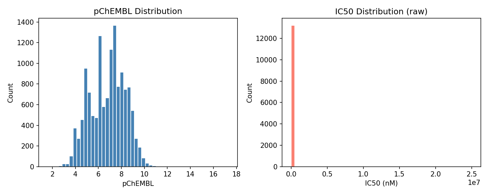
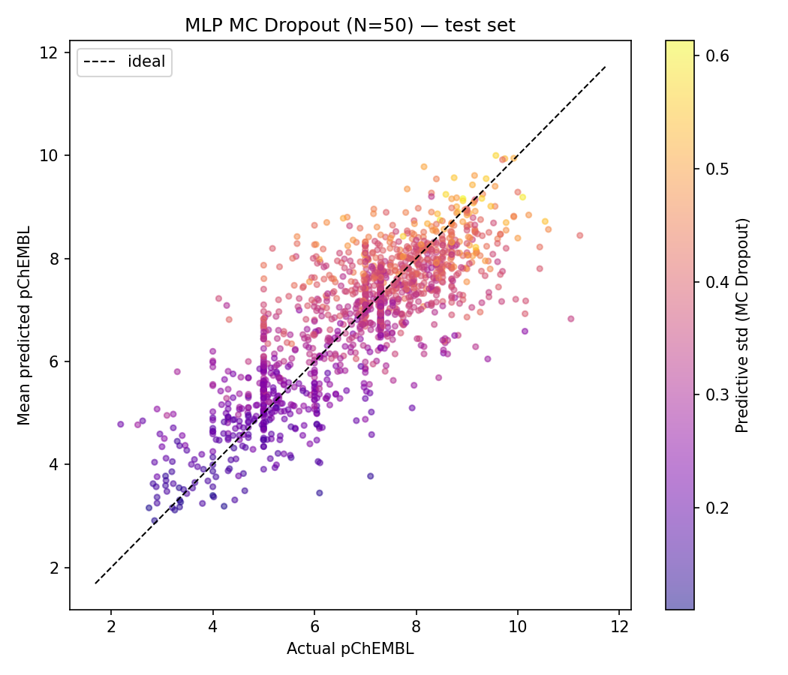
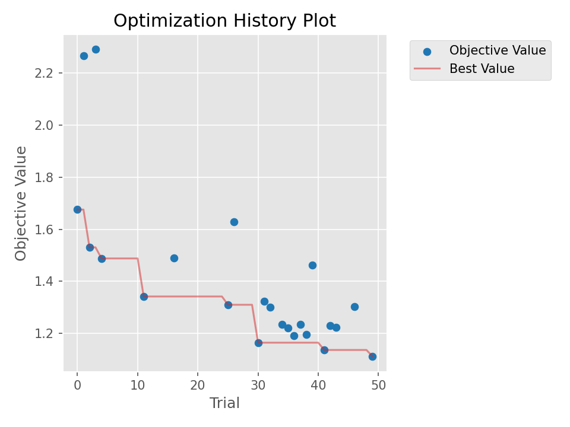
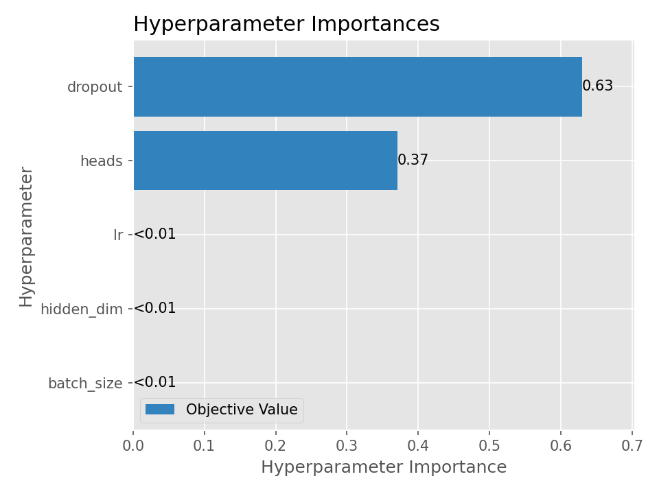

# Project Report

## Overview
This project builds an end-to-end machine learning pipeline to predict drug-target binding affinity from molecular structure, using real bioactivity data from ChEMBL. Molecules are represented as SMILES strings and converted into both Morgan fingerprints (for a baseline MLP) and molecular graphs (for a Graph Attention Network). A key differentiator is uncertainty quantification via MC Dropout — the model flags predictions it is least confident about rather than treating all outputs equally. Hyperparameter optimization is done using Optuna (Bayesian optimization).

**Target:** EGFR (CHEMBL203) — a kinase overexpressed in lung and colorectal cancer  
**Dataset:** 13,286 unique molecules, scaffold split 80/10/10  
**Task:** Regression — predict pChEMBL (binding affinity)

---

## Results

| Model | Features | RMSE | R² | Spearman ρ |
|---|---|---|---|---|
| MLP baseline | Morgan FP (2048-bit) | **0.93** | **0.65** | **0.78** |
| GAT v1 | 3 atom features | 1.10 | 0.52 | 0.67 |
| GAT v2 | 7 atom features | 1.05 | 0.56 | 0.72 |

### Uncertainty Quantification (MC Dropout, N=50)

| Model | Mean std | MAE high UQ | MAE low UQ |
|---|---|---|---|
| MLP | 0.34 | 0.72 | 0.68 |
| GAT v2 | 0.45 | — | — |

### Hyperparameter Optimization (Optuna, 50 trials)
Best val MSE: **1.11** — Learning rate was the dominant hyperparameter (importance 0.61), followed by dropout (0.26).

---

## Key Plots

---

## Key Findings
- The MLP baseline outperformed both GAT variants under CPU-constrained training — val MSE was still decreasing at epoch 200, meaning the GAT had not converged
- Expanding atom features from 3 to 7 improved all three GAT metrics without changing the architecture
- Learning rate is the dominant hyperparameter for the GAT — hidden dim is nearly irrelevant
- Uncertainty estimates carry signal: high-uncertainty molecules have higher prediction error than low-uncertainty ones